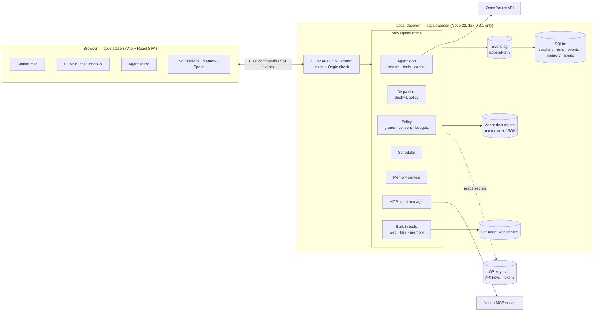
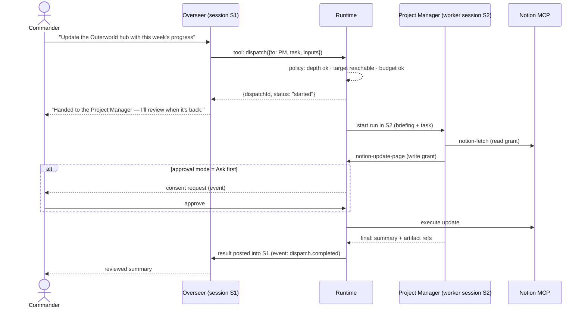
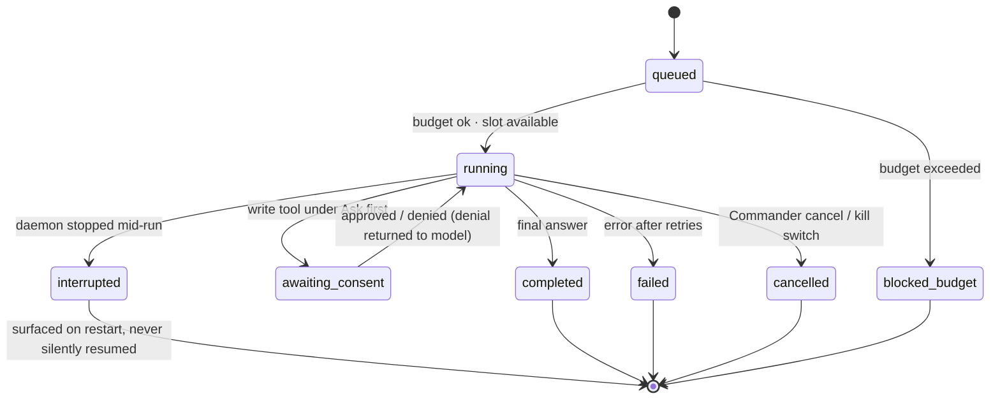

# Outerworld AI: Project Brief — Local Station Runtime

**Status:** Accepted direction, 2026-09-30. Supersedes the Claude Code Routines + ledger-repo direction (milestone 1).
**Owner:** Saul (Commander)
**Repo:** `DarthSaul/outerworld-ai` (MIT, public). This file lives at `docs/specs/BRIEF-station-runtime.md` and is the canonical statement of direction. Notion mirrors it.

---

## 1. Summary

Outerworld AI is a local-first agent harness with a space-station interface. You create AI agents, organize them into a Station, give them real capabilities, and watch them do real work with real model calls, real tools, and real cost. The interface is a projection of runtime state, not a simulation.

The app runs entirely on your machine: a Node **daemon** owns agents, model calls, tools, persistence, and scheduling; a React **SPA** in your browser talks to it over localhost. Model access is bring-your-own-key via **OpenRouter**. There is no Outerworld server; your data stays on disk except for model and connector calls you configure.

**Product law (unchanged from milestone 1):** the interface must never assert state the runtime cannot prove.

## 2. Why we changed direction

Milestone 1 rendered the state of Claude Code Routines from a git "ledger repo." That design had real strengths (cloud execution, subscription billing, laptop can be closed) but could not deliver what we actually want:

| We want | Routines + ledger could… |
|---|---|
| Streaming, persistent chat with any agent | No. Routines are scheduled or triggered, not conversational |
| Several agents running concurrently, visible live | No. The app was a read-only renderer of files pulled from git |
| Agents interacting (lead delegates, results return) in real time | Only asynchronously, via commits |
| Fine-grained agent customization usable immediately | Only by regenerating files and re-pasting routine prompts |
| Memory with approval ("awaiting your decision") | Only as files with no write path |

StarNet (androoAGI/starnet) demonstrated the alternative: a local runtime ("sidecar") that owns everything. We adopt that architecture and its vocabulary, and build our own implementation.

**Accepted trade-offs:** automated work only runs while the daemon is running (laptop on); model calls are metered on our OpenRouter key rather than a Claude subscription; the ledger repo and generator are archived.

## 3. Goals and non-goals

### v1 goals
1. Chat with any crew member in **COMMS**: streamed responses, sessions saved and re-openable.
2. **Overseer delegation**: the Overseer dispatches tasks to crew members (depth 1); workers run concurrently in the background; results return to the Overseer's session; everything visible live.
3. **Agents as documents**: identity, purpose, standing orders, context as markdown; model, approval mode, and grants as config. Edits in the UI take effect on the next run.
4. **Capabilities**: Props (placed objects) grant base tools per Room; connector tools granted per agent; consent gates for side-effectful calls.
5. **Notion MCP connector**: connected once, station-wide; per-agent tool allowlists (read-only vs read-write presets).
6. **Scheduler**: per-agent schedules (e.g. the Project Manager's daily briefing) while the daemon runs.
7. **Memory**: agents propose memories; the Commander approves or rejects; approved memories are injected into future runs.
8. **Notifications and spend**: a station-wide feed driven by the event log; per-run cost; budget caps enforced before model calls.
9. **Station view**: the existing map renders Rooms, crew, Props, and live activity from runtime state.

### v1 non-goals
Conveyor Lines, Inbox/Outbox/Logbook, webhooks, folder watchers, channel triggers, terminal/shell tools, recursive delegation, temporary helper copies, agents creating or editing other agents, desktop shell (Tauri/Electron), multiple connectors beyond Notion, embeddings-based memory retrieval, npm publishing.

## 4. Terminology

We adopt StarNet's vocabulary for now. All on-screen words live in `packages/core` glossary; code uses neutral identifiers, so any later rename is one file. These are generic nouns, but they are another product's vocabulary; revisit before any public release.

### Core terms

| Term | Meaning | Code identifier |
|---|---|---|
| **Station** | The whole system: all rooms, crew, props, hallways, runtime | `station` |
| **Commander** | You, the user | `user` |
| **Room** | A capability-scoped team; props placed in a room grant tools to its crew | `room` |
| **Crew / crew member** | The agents | `agent` |
| **Overseer** | The crew member holding the station-lead role (dispatch rights). A role, not "the first agent" | `role: "overseer"` |
| **Hallway** | An authorized handoff lane between rooms | `lane` |
| **Prop** (placed object) | A real capability grant, placed in a room | `grant` (kind `prop`) |
| **Connector** | An external MCP server installed station-wide (e.g. Notion); access granted per agent | `connector` |
| **COMMS** | The chat surface: sessions with individual crew members | `comms` |
| **Session** | One persistent conversation with one crew member | `session` |
| **Run** | One bounded agent execution (model loop + tools) inside a session | `run` |
| **Dispatch** | The Overseer handing a task to a crew member | `dispatch` |
| **Approval mode** | Per-agent consent setting: *Ask first* or *Full power* | `approvalMode` |
| **Memory: beliefs / proposals** | Approved memories / memories awaiting the Commander's decision | `memory` (`status`) |
| **Notifications** | Station-wide feed derived from the event log | `event` |

### Deferred terms (v2+)

| Term | Meaning |
|---|---|
| **Conveyor Line** | A fixed pipeline placed on a room's floor: Inbox → Bays → Outbox |
| **Bay** | One step in a line: an agent with *Gets / Does / Hands off / To* |
| **Inbox** | Line trigger: schedule, channel message, watched folder, webhook |
| **Outbox** | Line sink; delivered work recorded in its **Logbook** |

### Milestone 1 → new vocabulary

| Milestone 1 word | New word | Note |
|---|---|---|
| Station (a team) | **Room** | ⚠️ "Station" now means the whole system |
| Tool grant | **Prop** (or connector grant) | |
| Handoff / wire | **Hallway** | |
| Agent | **Crew member** | |
| Overseer | **Overseer** | Now a role with real dispatch tools |
| Routine run / Sortie | **Run** | |
| Ledger repo | **Station data directory** | Local disk, not git |
| Station Report / System Report | **Notifications** + session results | |

## 5. System architecture



**Process model.** One daemon process per Station. It serves the API and, in production, the built SPA. In development, Vite serves the SPA and proxies to the daemon. Agents only exist while the daemon runs.

**Package boundaries.**

| Package | Responsibility | May depend on |
|---|---|---|
| `packages/core` | Zod schemas, glossary, event types, pure policy functions (grant resolution, dispatch reach, depth checks), layout math | nothing runtime |
| `packages/runtime` | Agent loop, dispatcher, scheduler, tools, MCP client, memory, budgets, storage | `core` |
| `packages/ui` | React components, tokens, rigged character SVG, station map | `core` |
| `apps/daemon` | Process entry, HTTP/SSE server, auth, static serving, config loading | `core`, `runtime` |
| `apps/station` | SPA: routes, data fetching, SSE client, screens | `core`, `ui` |

Runtime logic never lives in `apps/*`, so it can later move into a desktop shell or worker without rewrites.

## 6. Capability model

An agent's effective tool set is computed by the runtime from four sources, then enforced twice: tools not granted are **not sent to the model**, and any call to a non-granted tool is **rejected at execution**.

| Source | Scope | v1 examples |
|---|---|---|
| **Role** | Per agent | Overseer: `dispatch`, `read_session` |
| **Props** | Per room (all crew in the room) | Web prop → `web_fetch`; Files prop → workspace `read_file` / `write_file` / `list_files`; Memory prop → `remember` |
| **Connector grants** | Per agent, per connector tool | Notion read-only preset (search, fetch) or read-write preset (+ create/update pages) |
| **Approval mode** | Per agent | *Ask first*: side-effectful calls pause for consent. *Full power*: auto-approve |

- Every tool is classified `read` or `write` (our mapping is authoritative; MCP `readOnlyHint` / `destructiveHint` annotations only seed defaults).
- Consent requests are events; the SPA shows them inline in COMMS and in Notifications. Pending consent pauses the run; it never times out into approval.
- All agents share the Station's single Notion identity; per-agent limits exist only in our runtime. Connect Notion with the narrowest page access that works.

## 7. Orchestration model (v1)

- **Depth 1.** Only agents holding the dispatch grant (the Overseer) can dispatch. Workers never receive the `dispatch` tool. `maxDispatchDepth: 1` is runtime policy, checked in one place.
- **Results return to the lead.** A worker's result is a short summary plus references to any workspace artifacts, posted into the Overseer's originating session. Workers never message each other.
- **Non-blocking.** Dispatch returns immediately with a dispatch ID. The Overseer may fan out to several workers and keep talking to the Commander; results arrive as events and are reviewed when they land.
- **Steer and stop.** The Commander can send a direction to a running worker or cancel it. Queued directions are visible and included in the lead's review.
- **Reach from the graph.** Allowed dispatch targets are computed from the station graph (v1: Overseer → every crew member). Adding rooms and hallways later adds edges; no rewrite.



## 8. Agent run lifecycle



**Prompt assembly per run:** system prompt = identity + purpose + standing orders + context documents + role briefing (e.g. crew roster for the Overseer) + approved memories selected for this agent; then the session history (windowed); then the new input. Tools = effective grant set.

**Loop:** stream model output → on tool call, check policy → (consent) → execute → append result → call model again → stop on final answer, max-steps, budget stop, or cancel. Every token delta, tool call, consent request, and state change is an event.

**Context management (v1):** keep the system prompt plus the most recent turns that fit a per-model token budget; older turns are dropped from the prompt (never from storage). Summarization/compaction is v2.

## 9. Data model

```mermaid
erDiagram
  ROOM ||--o{ AGENT : houses
  ROOM ||--o{ GRANT : "props placed"
  AGENT ||--o{ GRANT : "role / connector grants"
  CONNECTOR ||--o{ GRANT : "tools granted"
  AGENT ||--o{ SESSION : has
  SESSION ||--o{ MESSAGE : contains
  SESSION ||--o{ RUN : executes
  RUN ||--o{ TOOL_CALL : makes
  RUN ||--o{ SPEND : costs
  RUN ||--o| DISPATCH : "spawned by"
  AGENT ||--o{ SCHEDULE : has
  AGENT ||--o{ MEMORY : "beliefs / proposals"
  LANE }o--|| ROOM : from
  LANE }o--|| ROOM : to
  EVENT }o--o| RUN : about
```

**Storage split.**
- **Files** (human-editable, diffable): Station config, rooms, lanes, props, and each agent's documents and config.
- **SQLite** (append-heavy, queryable): events, sessions, messages, runs, tool calls, dispatches, memory items, schedules' run history, spend.
- **OS keychain:** OpenRouter key, connector OAuth tokens. Env var `OPENROUTER_API_KEY` is a dev fallback. Secrets never enter the station directory, the SPA, logs, or events.

**Station data directory** (`$OUTERWORLD_HOME`, default `~/.outerworld/`):

```
~/.outerworld/
  station.json              # station name, rooms, lanes, props, connectors (no secrets), budgets
  agents/
    <agent-id>/
      agent.json            # name, room, role, model, approvalMode, connectorGrants, schedule(s)
      identity.md
      purpose.md
      standing-orders.md
      context.md
  workspaces/<agent-id>/    # the only place Files-prop tools can read/write
  station.db                # SQLite
  logs/
```

## 10. Event model and realtime

- **Append-only event log** is the source of truth for live UI, Notifications, crash recovery, and replay. Each event: monotonically increasing `seq`, `type`, `at`, `agentId?`, `sessionId?`, `runId?`, `payload`.
- **Transport:** one SSE stream (`GET /events`) with `Last-Event-ID` replay from the log; commands are plain `POST`s. Multiple tabs are fine.
- **Token deltas** are streamed live but coalesced into the final message on completion, so the log stays compact.

Event families (v1): `session.*`, `run.*` (queued, started, delta, tool_call, tool_result, awaiting_consent, completed, failed, cancelled, interrupted), `dispatch.*`, `consent.*`, `memory.*` (proposed, approved, rejected), `schedule.*` (fired, missed), `agent.updated`, `connector.*`, `budget.*` (warning, blocked), `station.*` (started, stopped).

**Notifications** are a filtered projection of these events.

## 11. Security model

- Daemon binds to `127.0.0.1` only. Every request needs a per-install bearer token (generated on first start, handed to the SPA at load) and a matching `Origin`. This blocks other websites from driving your agents.
- Files tools are confined to the agent's workspace (path normalization, no symlink escape).
- No shell/terminal tool in v1.
- *Ask first* is the default approval mode; *Full power* is visibly marked in the UI.
- Tool results (web pages, Notion content) are untrusted data; standing orders tell agents so, and the policy layer, not the prompt, is the enforcement boundary.
- Budgets are enforced before each model call; a global kill switch cancels all runs. The kill-switch state is persisted before new work starts.
- `PRIVACY.md` is rewritten to state exactly what leaves the machine: model calls to OpenRouter, connector calls to Notion, `web_fetch` requests. Nothing else.

## 12. Connectors: Notion MCP (v1)

- The runtime is an MCP client (official TypeScript SDK). Connectors are installed once at the Station level; agents receive per-tool grants.
- **Target:** Notion's hosted MCP server over Streamable HTTP with OAuth. **Fallback** if OAuth is disproportionately costly for v1: a local stdio Notion MCP server with an internal integration token scoped to specific pages. The implementer verifies current Notion docs before choosing and records the decision in an ADR.
- UI: *Connectors* screen (connect, status, reconnect, tool list with read/write classification) and per-agent grant editor with *Read-only* / *Read-write* presets expanding to tool allowlists.

## 13. Scheduler (v1)

- Per-agent schedules defined in `agent.json`: cron expression, time zone, the prompt to run, and a target session (a dedicated "Scheduled" session per schedule by default).
- Runs only while the daemon is up. On startup, if the most recent occurrence was missed and `catchUp: true`, run it once; otherwise record `schedule.missed`.
- Scheduled runs obey the same grants, approval mode, and budgets. Under *Ask first*, a scheduled run that needs consent waits and raises a notification.

## 14. Memory (v1)

- **Write path:** agents with the Memory prop get a `remember` tool that creates a **proposal** (text, scope: agent or station, source run). Nothing becomes a belief without the Commander.
- **Review:** Memory screen per agent: *Stored beliefs* and *Awaiting your decision* (approve, edit-then-approve, reject). Beliefs can be edited or deleted later.
- **Read path:** approved beliefs for that agent plus station-scope beliefs are injected into the system prompt, most recent first, capped by a token budget. Embedding retrieval is v2.

## 15. Spend and budgets

- Record per-call usage and cost from OpenRouter responses; aggregate per run, agent, day.
- Budgets: per-run cap, per-agent daily cap, station daily cap. Checked before every model call; a blocked call emits `budget.blocked` and stops the run cleanly.
- Spend visible per session, per agent, and station-wide.

## 16. Release plan

### v1 — Station runtime (this brief)
Everything in §3 goals. **Done when:**
1. Fresh clone → `pnpm install && pnpm dev` → onboarding creates the Overseer, asks for the OpenRouter key, and the Commander can chat with streamed replies.
2. A Project Manager crew member with Notion read-write grants can be created in the UI and, via Overseer dispatch, update a Notion page with consent under *Ask first*, and the whole exchange is visible live.
3. The PM's daily-briefing schedule fires while the daemon runs, and its result appears in its session and in Notifications.
4. Killing the daemon mid-run surfaces the run as *interrupted* on restart; nothing is lost or duplicated.
5. Memory proposals appear for approval; approved beliefs demonstrably affect the next run.
6. Budget cap stops a run before exceeding it.
7. `pnpm check:task` green; CI uses a fake model provider and makes no network calls.

### v2 — Lines and power tools
Conveyor Lines (Inbox with manual + schedule triggers, Bays with Gets/Does/Hands off/To, Outbox with Logbook); pipeline vs dispatch hallway kinds; cross-room lead-to-lead handoffs (`maxDispatchDepth: 2`); consent-gated terminal prop; Overseer tools to create agents and edit agent documents; temporary helper copies; session summarization/compaction.

### v3 — Connected station
More MCP connectors; channel, webhook, and watched-folder Inbox triggers; visual station editing (place props, draw hallways); embeddings-based memory retrieval; desktop shell (Electron or Tauri) with tray and launch-on-login; npm publishing.

## 17. First crew

| Crew member | Room | Role | Grants | Notes |
|---|---|---|---|---|
| **Overseer** | Command | Overseer | dispatch, read_session, Web, Memory | Created at onboarding. Name TBD (naming-workshop candidates: Meridian, Lodestar, Vesper) |
| **Project Manager** | Operations | Crew | Notion read-write, Web, Memory, Files | Owns project hubs in Notion; daily briefing schedule |

## 18. What happens to the existing repo

| Milestone 1 asset | Fate |
|---|---|
| `packages/core` | **Kept and extended**: new schemas (Station, Room, Agent, Grant, Lane, Event…), glossary renamed, pure policy functions |
| `packages/ui` | **Kept**: rigged character, tokens, map; adapted to the new model |
| `apps/web` (Next.js) | **Replaced** by `apps/station` (Vite SPA) + `apps/daemon` |
| `packages/generator`, `templates/ledger-repo` | **Archived** (removed from the workspace; history remains in git) |
| `fixtures/demo-station` | **Rewritten** as a demo station data directory (fictional data only) |
| ADRs 0001–0007 | Reviewed; Routines/ledger/Next.js decisions marked *Superseded by ADR-0008* |
| `PRIVACY.md`, `ARCHITECTURE.md`, `SCHEMA.md`, `README.md`, `CLAUDE.md`, `CONSTRAINTS.md` | Rewritten for the runtime |

## 19. Risks and open questions

| Risk / question | Mitigation / owner |
|---|---|
| Runtime correctness under concurrency and restarts | Event log as source of truth; explicit run state machine; restart tests |
| Tool safety on a real machine | Workspace confinement, no shell in v1, *Ask first* default, double enforcement |
| Cost runaway from delegation | Depth 1, budgets before every call, kill switch |
| Notion OAuth complexity | Stdio + integration-token fallback, decided by ADR |
| Model variance on OpenRouter (tool-calling quality) | Support a small tested model list in v1 |
| Memory quality (noise, stale beliefs) | Human approval gate; token cap; iterate after use |
| Context growth in long sessions | Windowing in v1; compaction in v2 |
| StarNet vocabulary in a public repo | Glossary indirection; revisit naming before public release |
| Overseer name | Open: pick before first public screenshot |
